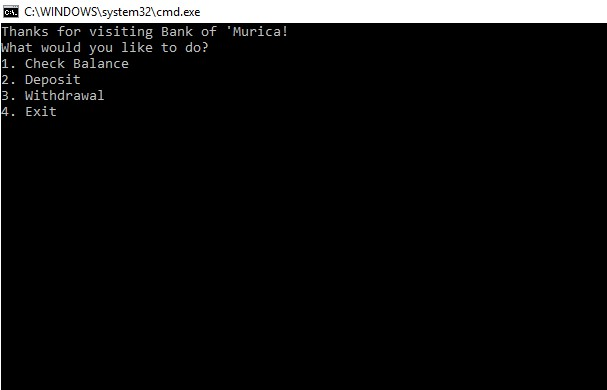

# Lab02-UnitTesting

## About this project
This program functions as an ATM at the Bank of 'Murica. The user starts with a $5000 balance, and is able to view their balance, withdraw, or deposit funds. The program continues until the user elects to exit. Exception handling is in place to ensure that the user enters valid input and no crashes take place. The user is also not able to add a negative amount to their balance, or substract a negative amount from their balance. The user is also not able to overdraw their account.

## Example

## How to use
This program requires Visual Studio. Once the repo has been cloned to the user's local machine, they simply need to open the solution using Visual Studio and run the program. Afer that, follow the prompts. The test file can be opened via the test solution also located in the project directory.

## Licensing
This program is available under the MIT license.
